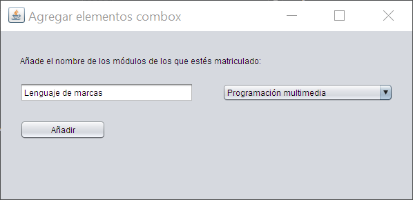

# Práctica 2.3 – Elemento combobox

El objetivo es aprender a manipular modelos de datos en un *combobox*, controlar duplicados y personalizar la interfaz gráfica mediante eventos así como aplicar un Look and Feel moderno mediante una librería externa en *Maven*.

Utiliza *branches* para delimitar los cambios entre las `partes` que vayas haciendo.

## Parte 1

- Crea un nuevo proyecto de tipo **Maven**.
- Crea una ventana que permita agregar elementos al listado de un *combobox* al darle al botón añadir.
- La interfaz debe **evitar duplicados**: no se podrán introducir elementos repetidos en el combobox.

## Parte 2

Se va a mejorar el ejercicio anterior con nuevos botones y un Look and Feel moderno:

- Agrega un botón Agregar todo que incluya de golpe todos los módulos del curso en el combobox.
- Agrega un botón Borrar todo que vacíe el combobox.
- Cambiar el **Look and Feel** de la ventana por defecto para que utilice **flatLaf**, una librería moderna actual que permite dar un aspecto profesional y moderno a las interfaces Swing:
    - Para ello deberás añadir a tu fichero `pom.xml` las líneas necesarias para agregar dependencias buscando en el [respositorio oficial de Maven](https://mvnrepository.com/) la última versión de flaLaf (Flat Look and Feel)
    - Después deberás de agregar el *import* y utilizarlo en el *main* de la clase, editando el código ya propuesto de la línea *Look and feel setting code (optional)* para usar flatLaf.
 

## Parte 3

En esta se va a mejorar la interactividad y la personalización de la aplicación agregando nuevas funcionalidades:

1. **Selección de Look and Feel**
    - Crea un nuevo combobox que permita elegir entre tres estilos visuales para la aplicación:
        - Clásico (Look and Feel por defecto de Swing, Nimbus o el del sistema operativo).
        - FlatLaf Light (tema claro moderno).
        - FlatLaf Dark (tema oscuro moderno).
2. **Gestión de cursos y módulos**
    - Añade otro combobox para seleccionar el curso: Primero o Segundo.
    - Cuando se agregue un módulo de forma manual, el nombre debe incluir al principio 1º o 2º según el curso seleccionado.
    - El botón Agregar todos debe cargar únicamente los módulos correspondientes al curso elegido.
3. **Eliminación de elementos individuales**
    - Agrega un botón que permita borrar únicamente el módulo seleccionado del combobox de módulos.
    - Este botón debe mostrar un icono de papelera en lugar de texto para representar de manera visual la acción de eliminar.

## Pruebas (testing) 

Deberá de subirse a la carpeta `TESTING` con el resultado verificado (OK/No cumple)

### Tabla pruebas parte 1 y 2 ✅

| ID Caso Prueba | Descripción Caso de Prueba        | Entrada                | Salida Esperada                                                     | Resultado    |
| -------------- | --------------------------------- | ---------------------- | ------------------------------------------------------------------- | ------------ |
| 01             | Comprobación del botón "Agregar"  | Texto del campo módulo | Se agrega el texto del módulo al combobox.                          | OK/No cumple |
| 02             | Validación de duplicados          | Texto ya existente     | No permite agregar un campo duplicado y avisa con un mensaje modal. | OK/No cumple |
| 03             | Botón "Agregar todo"              | N/D                    | Agrega todos los módulos del curso al combobox.                     | OK/No cumple |
| 04             | Botón "Borrar todo"               | N/D                    | Borra todo el contenido del combobox.                               | OK/No cumple |
| 05             | Look and Feel inicial con FlatLaf | N/D                    | La aplicación inicia con el Look and Feel FlatLaf aplicado.         | OK/No cumple |

### Tabla pruebas parte 3 ✅

| ID Caso Prueba | Descripción Caso de Prueba                | Entrada                           | Salida Esperada                                                                  | Resultado    |
| -------------- | ----------------------------------------- | --------------------------------- | -------------------------------------------------------------------------------- | ------------ |
| 01             | Selección de Look and Feel: clásico       | Seleccionar "Clásico" en combo    | La aplicación cambia al Look and Feel del sistema/Nimbus.                        | OK/No cumple |
| 02             | Selección de Look and Feel: FlatLaf Light | Seleccionar "FlatLaf Light"       | La aplicación cambia al estilo FlatLaf claro.                                    | OK/No cumple |
| 03             | Selección de Look and Feel: FlatLaf Dark  | Seleccionar "FlatLaf Dark"        | La aplicación cambia al estilo FlatLaf oscuro.                                   | OK/No cumple |
| 04             | Selección combobox curso                  | Seleccionar "Primero" o "Segundo" | Los módulos añadidos manualmente llevan prefijo `1º` o `2º` según el curso.      | OK/No cumple |
| 05             | Botón "Agregar todo" con curso elegido    | Seleccionar curso y pulsar botón  | Se agregan todos los módulos correspondientes al curso seleccionado.             | OK/No cumple |
| 06             | Botón "Borrar elemento"                   | Seleccionar un módulo en combo    | El módulo seleccionado se elimina del combobox y el botón muestra icono papelera | OK/No cumple |

 
