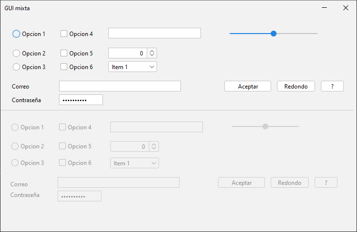
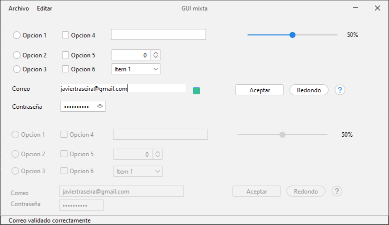

# Práctica 2.3 – Componentes gráficos y eventos

El objetivo de esta práctica es profundizar en el uso de componentes gráficos y en la gestión de eventos, creando una interfaz formada por dos zonas que deberán mantenerse sincronizadas.

Durante la práctica se trabajará con distintos tipos de controles, diferentes eventos y listeners, menús, validación en tiempo real y algunas propiedades específicas de FlatLaf.

## Preparación del proyecto

Crea dentro de la carpeta `SOL` de tu repositorio local un nuevo proyecto Maven de Apache NetBeans llamado:

`practica2-3`

Utiliza ramas para separar las distintas partes de la práctica.

Como mínimo deberán existir:

- `parte-1`
- `parte-2`
- `parte-3`
- `parte-4`

Cada parte deberá desarrollarse inicialmente en su rama correspondiente y posteriormente integrarse en `main`.

Realiza commits descriptivos durante el desarrollo.

La aplicación deberá utilizar **FlatLaf**, añadiendo la dependencia correspondiente al fichero `pom.xml`, tal y como se realizó en la práctica anterior.

> Recuerda que todos los componentes utilizados en la interfaz desde código deberán tener nombres descriptivos.


## Parte 1 Creación de componentes y sincronización mediante eventos

Crea mediante el editor visual de Netbeans una interfaz mixta utilizando *FlatLaf* con los elementos indicados y con ellos duplicados en espejo.

Los cambios en la primera parte de la interfaz, sea una imagen para la otra mitad de forma inmediata, excepto al primer campo de texto, que deberá mostrar el duplicado con el texto en *orden inverso*.

Se hará uso de los siguientes **controles clásicos** de una interfaz:

-   *2 Campos de texto (JTextField)*
-   *1 Campo de Password (JPasswordField)*
-   *3 Botones (JButtons)*
-   *3 Radio buttons (JRadiobutton)*
-   *3 Casillas verificación (JCheckbox)*
-   *1 Listado (JCombobox)*
-   *1 Barra deslizadora (JSlider)*
-   *1 JSpinner*



Puedes utilizar `JPanel` para organizar los componentes.

### Sincronización de componentes

Los cambios realizados en la zona superior deberán reflejarse automáticamente en el componente equivalente de la zona inferior. 
Para ello habrá que hacer uso de los **eventos** relacionados con cada componente, para duplicarlos en su correspondiente elemento. 

Así, por ejemplo:

- al escribir en un campo de texto, el otro deberá actualizarse;
- al marcar un `JCheckBox`, el correspondiente deberá cambiar al mismo estado;
- al seleccionar una opción del `JComboBox`, el otro deberá seleccionar el mismo elemento;
- al mover el `JSlider`, deberá actualizarse el segundo;
- al modificar el `JSpinner`, deberá mostrarse el mismo valor en el otro.

### Campos de texto en tiempo real

La actualización de los JTextField deberá producirse mientras el usuario escribe, sin necesidad de pulsar Enter.


### Sincronización de componentes

El primero de los campos `JTextField` tendrá un comportamiento diferente.

El texto escrito en el campo izquierdo deberá mostrarse en el campo derecho en orden inverso.

### Uso de eventos

Durante esta parte deberás utilizar al menos **cuatro tipos diferentes de eventos o listeners**.

Por ejemplo:

| Componente | Evento o listener |
|---|---|
| `JButton` | `ActionListener` |
| `JCheckBox` | `ItemListener` |
| `JComboBox` | `ActionListener` |
| `JSlider` | `ChangeListener` |
| `JSpinner` | `ChangeListener` |
| `JTextField` | `DocumentListener` |

## Parte 2 Menú, barra de estado y validación en tiempo real

### Menú

Amplía la ventana añadiendo una barra de menús mediante `JMenuBar`.

Deberá contener como mínimo:

```text
Archivo
Edición
```

**Menú Archivo**

Añade al menos la opción:

```text
Salir
```

que deberá cerrar correctamente la aplicación.

**Menú Edición**

Añade la opción:

```text
Borrar todo
```

Al seleccionarla, todos los componentes deberán volver a su estado inicial.

Evita realizar todas estas operaciones directamente dentro del evento del menú.

### Barra de estado

Añade un `JPanel` en la parte inferior de la ventana que funcione como **barra de estado**.

Dentro puede incluirse un `JLabel`.

Por ejemplo:

```java
lblEstado
```

La barra deberá mostrar mensajes relacionados con algunas acciones de la aplicación.

Por ejemplo:

```text
Formulario reiniciado
Correo válido
Selección modificada
Tema actualizado
```

### Validación de correo en tiempo real

Uno de los `JTextField` deberá utilizarse para introducir una dirección de correo electrónico.

Mientras el usuario escribe deberá comprobarse si el formato es correcto.

Puedes utilizar:

```java
matches(...)
```

con una expresión regular sencilla.

Por ejemplo, deberá reconocer correctamente valores similares a:

```text
usuario@dominio.com
```

Cuando el correo no sea válido:

- el campo deberá mostrar un borde de color rojo;
- la barra de estado deberá indicar que el correo no es válido.

Cuando el correo sea válido:

- deberá recuperarse el borde normal;
- deberá marcarse automáticamente un `JCheckBox` destinado a indicar que el correo es válido;
- la barra de estado deberá mostrar un mensaje correspondiente.

Crea un método auxiliar como:

```java
private boolean validarCorreo(String correo)
```

### Parte 3. Personalización con FlatLaf

Utiliza algunas propiedades específicas de FlatLaf para modificar ciertos componentes.

### Campo de contraseña

Configura el `JPasswordField` para que permita mostrar u ocultar temporalmente la contraseña mediante un botón integrado.

Investiga las propiedades disponibles en:

```java
FlatClientProperties
```

para conseguir este comportamiento.

---

### Botón redondeado

Uno de los botones deberá utilizar un estilo redondeado mediante:

```java
FlatClientProperties.BUTTON_TYPE
```

con:

```java
FlatClientProperties.BUTTON_TYPE_ROUND_RECT
```

Por ejemplo:

```java
btnRedondo.putClientProperty(
    FlatClientProperties.BUTTON_TYPE,
    FlatClientProperties.BUTTON_TYPE_ROUND_RECT
);
```


---

### Botón de ayuda

Otro botón deberá utilizar el estilo específico de ayuda proporcionado por FlatLaf.

Puedes utilizar:

```java
btnAyuda.putClientProperty(
    FlatClientProperties.BUTTON_TYPE,
    FlatClientProperties.BUTTON_TYPE_HELP
);
```
- Tendrá un `Tooltip` que muestre informe de que al pulsar el botón se mostrará información de ayuda.
- Al pulsarlo deberá mostrarse un `JOptionPane` con una breve explicación sobre la aplicación.




## Documentación

Añade a una carpeta `docs\` del repositorio un fichero:

```text
README.md
```

Que incluya como mínimo:

- Nombre del proyecto
- Descripción: Breve explicación de la aplicación desarrollada.
- Listado de componentes swing utilizados.
- Eventos utilizados
- Funcionalidades: Lista de las principales características implementadas.
- Capturas de la aplicación.

Incluye una tabla similar a la siguiente:

| Componente | Evento o listener utilizado | Función |
|---|---|---|
| `JTextField` | `DocumentListener` | Detectar cambios mientras se escribe |
| `JButton` | `ActionListener` | Detectar pulsaciones |
| `JCheckBox` | `ItemListener` | Detectar cambios de estado |
| `JSlider` | `ChangeListener` | Detectar cambios de valor |


## Pruebas (testing) 

# Comprobación final

Antes de entregar la práctica comprueba:

- [ ] El proyecto es Maven.
- [ ] FlatLaf está añadido correctamente mediante Maven.
- [ ] El proyecto compila y se ejecuta sin errores.
- [ ] Los componentes utilizados desde código tienen nombres descriptivos.
- [ ] La interfaz contiene los componentes requeridos.
- [ ] La interfaz está organizada en una zona superior y una zona inferior.
- [ ] Los cambios realizados en la zona superior se sincronizan automáticamente con la zona inferior.
- [ ] El primer campo de texto se muestra en orden inverso.
- [ ] Se utilizan al menos cuatro tipos diferentes de eventos o listeners.
- [ ] Los `JRadioButton` funcionan mediante `ButtonGroup`.
- [ ] El correo se valida en tiempo real.
- [ ] La barra de estado muestra mensajes correctamente.
- [ ] El menú Archivo permite cerrar la aplicación.
- [ ] El menú Edición permite reiniciar los componentes.
- [ ] Se utilizan métodos auxiliares para organizar el código.
- [ ] El campo contraseña utiliza una propiedad específica de FlatLaf.
- [ ] El botón redondeado utiliza propiedades de FlatLaf.
- [ ] El botón de ayuda funciona correctamente.
- [ ] El `README.md` está actualizado.
- [ ] Los casos de prueba se han ejecutado y documentado.
- [ ] Las ramas de trabajo se han integrado correctamente en `main`.

En todos los ejercicios debe de rellenarse una tabla con **casos de prueba** mínimos que cumpla el ejercicio dentro de la carpeta llamada *TEST* del repositorio:

| ID | Caso de prueba | Entrada / Acción | Resultado esperado | Resultado |
|---|---|---|---|---|
| 01 | Primer campo de texto | Escribir `Hola` en la zona superior | En la zona inferior aparece `aloH` | OK / No cumple |
| 02 | Segundo campo de texto | Escribir texto | Se copia exactamente en el campo correspondiente | OK / No cumple |
| 03 | Campo contraseña | Introducir contraseña | Se sincroniza manteniéndose oculta | OK / No cumple |
| 04 | Mostrar contraseña | Activar botón integrado | La contraseña puede mostrarse y ocultarse | OK / No cumple |
| 05 | Radio buttons | Seleccionar una opción | Se replica la selección y se mantiene la exclusividad | OK / No cumple |
| 06 | Checkboxes | Marcar o desmarcar | El estado se replica en el componente correspondiente | OK / No cumple |
| 07 | JComboBox | Cambiar selección | El segundo `JComboBox` selecciona el mismo elemento | OK / No cumple |
| 08 | JSpinner | Cambiar valor | El segundo `JSpinner` muestra el mismo valor | OK / No cumple |
| 09 | JSlider | Cambiar valor | El segundo `JSlider` muestra el mismo valor | OK / No cumple |
| 10 | Botones | Pulsar cada botón | La acción definida se refleja correctamente | OK / No cumple |
| 11 | Correo incorrecto | Introducir formato no válido | Se muestra borde rojo y mensaje de error | OK / No cumple |
| 12 | Correo correcto | Introducir correo válido | Se restaura el borde, se marca el checkbox y se actualiza el estado | OK / No cumple |
| 13 | Menú Salir | Seleccionar `Archivo → Salir` | La aplicación se cierra correctamente | OK / No cumple |
| 14 | Borrar todo | Seleccionar `Edición → Borrar todo` | Todos los componentes vuelven a su estado inicial | OK / No cumple |
| 15 | Botón redondeado | Observar el componente | Se muestra con el estilo FlatLaf configurado | OK / No cumple |
| 16 | Botón ayuda | Pulsar el botón | Se muestra un mensaje de ayuda | OK / No cumple |

Añade al final cualquier incidencia encontrada durante las pruebas.


