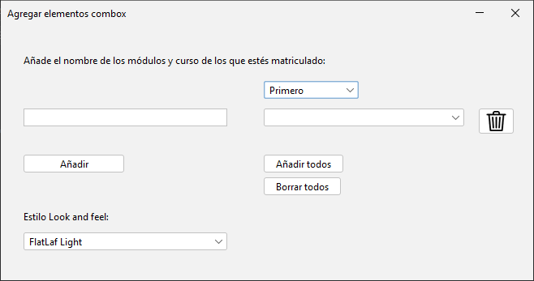

# Práctica 2.3 – Elemento combobox

## Parte 1

Crea una ventana que permita agregar elementos al listado de un *combobox* al darle al botón añadir.

❗ No debe permitir agregar duplicados ya existentes en la lista.

## Parte 2

Mejorar el ejercicio anterior para que haya exista un botón **agregar todo** que agregue todos los módulos del curso y otro botón **borrar todo** del *combobox* anterior. 

Averigua la forma de cambiar el *Look and Feel* de la ventana por defecto al que utiliza el sistema Windows.

## Parte 3

Añade otro *combobox* para poder elegir curso:
- Según esté elegido *Primero* o *Segundo* deberá agregar al principio del nombre del módulo a introducir 1º o 2º.
- Según esté seleccionado uno u otro curso deberá de cargar todos los módulos de dicho curso seleccionado, al presionar el botón *añadir todos*.
- Agrega un botón de borrar un solo elemento seleccionado del listado de módulos usando un icono de una papelera.

## Pruebas (testing) 

### Tabla pruebas parte 1 y 2

| ID Caso Prueba | Descripción Caso de Prueba         | Entrada                   | Salida Esperada                                                     | Resultado   |
|----------------|-----------------------------------|---------------------------|---------------------------------------------------------------------|-------------|
| 01             | Comprobación del botón "agregar"   | Texto del campo módulo    | Se agrega el texto del módulo al combobox.                           | OK/No cumple|
| 02             | Validación de duplicados           | Texto del campo módulo    | No permite agregar un campo duplicado y avisa con un mensaje modal.  | OK/No cumple|
| 03             | Botón "agregar todo"               | N/D                       | Agrega todos los módulos del curso al combobox.                       | OK/No cumple|
| 04             | Botón "borrar todo"                | N/D                       | Borra todo el contenido del combobox.                                 | OK/No cumple|
| 05             | Look and feel de la aplicación     | N/D                       | Se ha modificado el look and feel por defecto.                        | OK/No cumple|

### Tabla pruebas parte 3

| ID Caso Prueba | Descripción Caso de Prueba      | Entrada                  | Salida Esperada                                          | Resultado   |
|----------------|--------------------------------|--------------------------|----------------------------------------------------------|-------------|
| 01             | Selección combobox curso        | Seleccionar curso combobox| Agrega el curso 1º/2º al inicio del texto en el combobox principal | OK/No cumple|
| 02             | Botón "agregar todo"            | Seleccionar curso combobox| Agrega todos los módulos del curso seleccionado en el combobox | OK/No cumple|
| 03             | Botón "borrar"                  | Seleccionar curso combobox| Borra el curso del combobox que esté seleccionado         | OK/No cumple|
 
